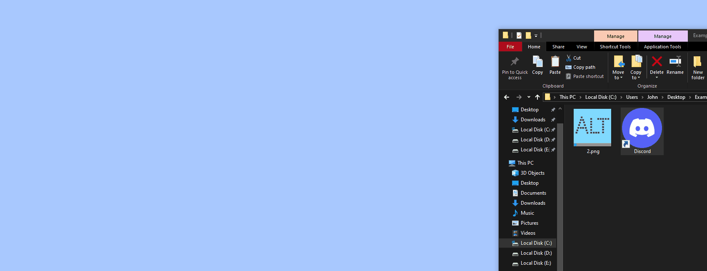
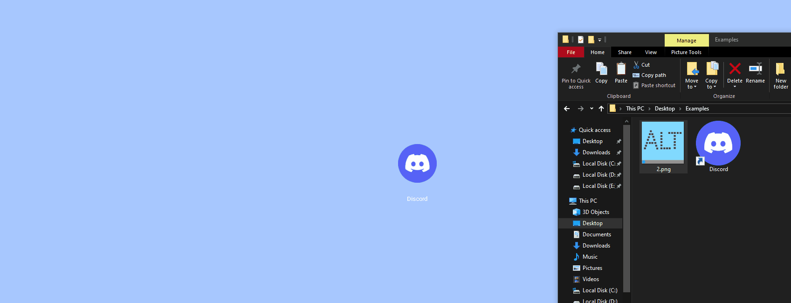

# Alternative-Desktop

A very modifiable Alternative to the base Windows desktop.

## Features:  
Keybind to minimize/maximize  
Opacity setting  
Themes  
Video, and static backgrounds.  
Automatically generate Icons from Files or Website  
Renaming icons  
Custom icon images  
Executable and Website link in one icon  
Run functions, Double click to run the executable, the website link, or a menu to ask which to launch.  
Add command line arguments to your executable path.  

### Installing: 
Check Releases on the right side then download and run **Alternative.Desktop.Installer.exe** 

### Uninstall: 
Uninstall through Platform default or by launching unins000.exe wherever you installed it  
(default directory: C:\Program Files (x86)\Alternative Desktop))

### Example features:

Create an Icon: Either double click any + icon or right click -> edit icon to begin editing an icon.  

Easily drag and drop any file onto the desktop into an icon area. To instead begin an icon with the executable set.  
Upon saving with no custom icon set it will even Automatically generate an Icon from the file you dropped.  

Setting a custom Icon? You can drag it directly to start an icon with the custom image. You can even drag it on an existing icon to overrite its existing icon.  

Edit an icon at any time by right click -> edit icon. Add a website and you can even Auto generate an icon from a website. Choose from all found icons the one you like best.  

In the right click menu you can set the default launch option (double click), You can even just select to run the application or open the website. Or open the file paths for the exectuable or icon path. And even Delete the icon.

Want to move the desktop icon? Just click and drag it!
  

## Developer stuff below:

### Base Requirements: 
Python  
pip (https://pip.pypa.io/en/stable/installation/)  
pyinstaller (only for building the executable. pip install pyinstaller)  
Inno setup compiler (only for building the installer. https://jrsoftware.org/isdl.php)  
requests   	(pulling updates from github, pip install requests)
Pyside6 	(Qt for Python, pip install PySide6)     
PIL 		(Python Imaging Library, pip install pillow)   
icoextract  (Extracting icons from .exe, pip install icoextract)  
qt-material (stylesheets, pip install qt-material)  
send2trash (recycle bin instead of outright deletion of icons, pip install send2trash)  
pywin32     (dealing with some windows functions, pip install pywin32 (can be somewhat annoying to install, if not working try: python -m pip install pywin32) or after installation: python Scripts/pywin32_postinstall.py -install)
Markdown    (Markdown formatting, pip install markdown)  
Keyboard    (setting a hotkey, pip install keyboard)

### Step 1: Building .exe
open command prompt

cd to file location i.e. C:\...\github\Alternative-Desktop

pyinstaller --onefile --noconsole AlternativeDesktop.py

Should create the folders: build, dist, and AlternativeDesktop.spec the important one being the .exe in /dist/

### Step 2: Inno setup

Install Inno Setup and open AlternativeDesktopInstaller_Example.iss in Inno Setup Compiler.

Generate a new GUID through Tools -> Generate GUID

Replace **GUID** in the Example file with the generated GUID

### Step 3: To make this into installer
Click Build -> compile, To get the Installer exe

